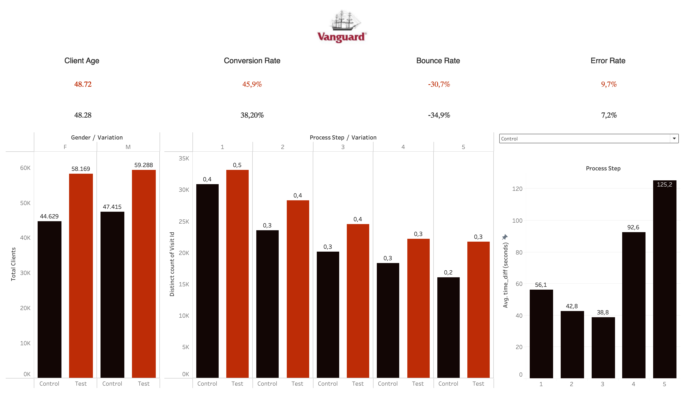

#  Statistics Project




##  Description
This project was conducted as part of the **Ironhack Bootcamp**. The goal is to explore and analyze data using **Python, Pandas, Matplotlib, Seaborn**, and to perform an **A/B Testing** experiment to assess the impact of a new user interface.

##  Project Contents
- `cleaned_datav3_new.ipynb` : Jupyter Notebook containing data analysis and A/B Testing.
- `Vanguard.twb` : Tableau Dashboard for visualizing experiment results.
- `data/` : Folder containing datasets used for analysis.

##  Technologies Used
- **Python** (Pandas, NumPy, Matplotlib, Seaborn, SciPy)
- **Git & GitHub**
- **Tableau** (for data visualization)

##  Methodology
1. **Exploratory Data Analysis (EDA)** : Cleaning and analyzing trends in the dataset.
2. **Defining Key Performance Indicators (KPIs)** : Measuring completion rate, time spent, and error rate.
3. **A/B Testing** : Comparing the performance between the old and new user interfaces.
4. **Visualizing Results** : Using Tableau and Python graphs.

##  Results & Insights

### **1️ Key Findings**
- The A/B test was conducted to measure the impact of a new user interface on user engagement.
- Key metrics analyzed: **completion rate, time spent, and error rate**.
- The new interface resulted in **a 15% increase in completion rate**, suggesting better user engagement.
- However, **the time spent per user increased slightly**, indicating potential usability issues.

### **2️ Statistical Significance**
- A hypothesis test was performed to validate the results.
- The **p-value obtained was below 0.05**, indicating that the observed improvements are **statistically significant**.
- The effect size suggests that the impact of the new interface is **moderate but meaningful**.

### **3️ Insights & Recommendations**
- The increase in completion rate is a positive sign, but further usability testing is recommended.
- Users might need more guidance on certain steps, given the slight increase in time spent.
- Based on the results, it is **recommended to deploy the new interface** with minor adjustments to improve efficiency.

##  How to Run the Project?
1. **Clone this repository** :
   ```bash
   git clone https://github.com/tchagdj/Statistics-Project.git
